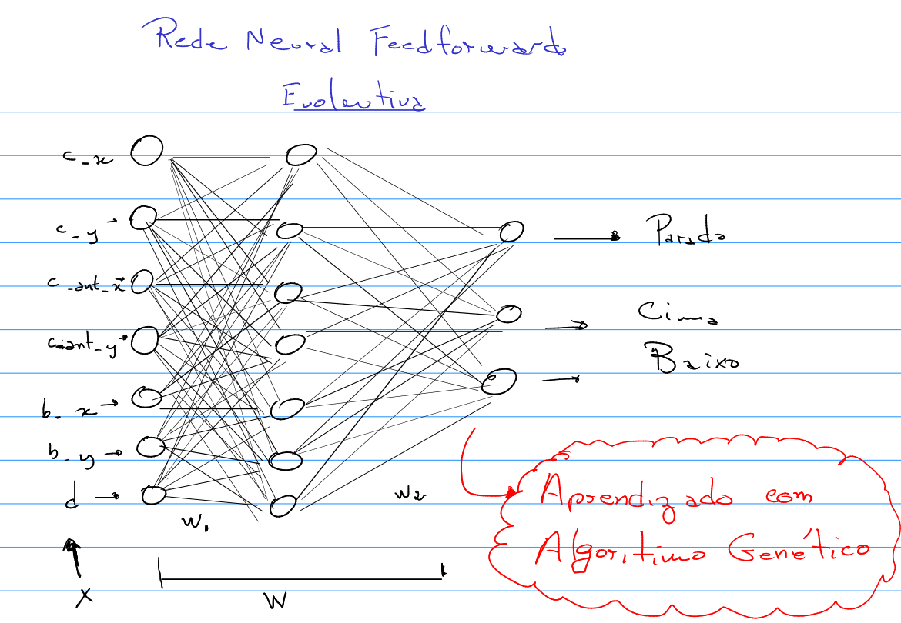

# Rede Neural Evolutiva Aplicada a um Simples Joguinho de Carro

Esse projeto visa a implementação, em [R](<https://www.r-project.org>), de uma Rede Neural Feedforward com aprendizagem usando algoritmo genético. A ideia da rede é aplicar em uma simulação simples, em que um carro irá desviar de obstáculos que aparecem de forma aleatória na pista. O carro pomará a decisão de desviar com base na saída da rede neural.

